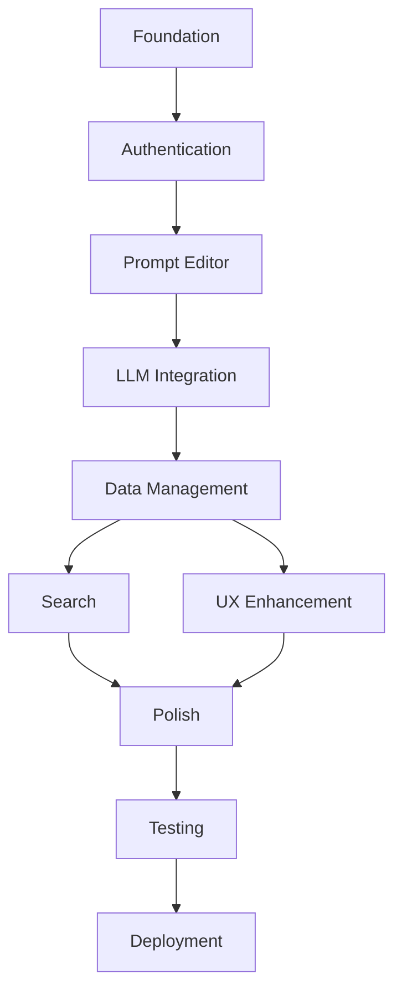

# Mage Craft - Comprehensive Implementation Plan

## Project Overview
**Goal**: Build a production-ready prompt engineering platform with structured editor, LLM integration, and comprehensive prompt management system.

**Tech Stack**:
- Frontend: Next.js 14, TypeScript, Tailwind CSS, shadcn/ui
- Backend: Supabase (Auth, Database, Realtime)
- LLM: OpenAI/Gemini API
- Deployment: Vercel

## Phase 1: Foundation & Infrastructure ✅ (Partially Complete)

### 1.1 Database Architecture ✅
- [x] Create Supabase schema (users, profiles, prompts, folders)
- [x] Set up Row Level Security policies
- [x] Create database migration file

### 1.2 Supabase Integration ✅
- [x] Install Supabase dependencies
- [x] Configure client/server utilities
- [x] Create auth utilities
- [x] Set up middleware for protected routes
- [x] Create type definitions

### 1.3 Core UI Components (In Progress)
- [x] Install form component dependencies
- [x] Create form.tsx with validation support
- [x] Create alert.tsx for notifications
- [x] Create skeleton.tsx for loading states
- [x] Create sonner.tsx for toast notifications
- [x] Create alert-dialog.tsx for confirmations
- [ ] Create progress.tsx for LLM processing
- [ ] Create avatar.tsx for user profiles
- [ ] Create badge.tsx for status indicators

## Phase 2: Authentication System

### 2.1 Authentication Pages
**Task**: Create login and signup pages with form validation
**Subtasks**:
- [ ] Create /app/login/page.tsx
- [ ] Create /app/signup/page.tsx
- [ ] Create /components/auth/login-form.tsx
- [ ] Create /components/auth/signup-form.tsx
- [ ] Implement zod schemas for validation
- [ ] Add password strength indicator
- [ ] Implement remember me functionality
- [ ] Add social auth buttons (future)

### 2.2 Auth Flow Integration
**Task**: Connect auth forms to Supabase
**Subtasks**:
- [ ] Implement signup with email confirmation
- [ ] Implement login with error handling
- [ ] Create password reset flow
- [ ] Add auth state management
- [ ] Implement session persistence
- [ ] Add logout functionality
- [ ] Create protected route wrapper

### 2.3 User Profile Management
**Task**: Create user profile functionality
**Subtasks**:
- [ ] Create profile settings page
- [ ] Implement avatar upload
- [ ] Add theme preference toggle
- [ ] Create profile update form
- [ ] Add account deletion flow

## Phase 3: Prompt Editor Implementation

### 3.1 Structured Editor Component
**Task**: Build the core prompt editor with validation
**Subtasks**:
- [ ] Create /components/prompt-editor/editor.tsx
- [ ] Implement five field structure (Role, Personality, Instruction, Context, Example)
- [ ] Add zod validation schemas
- [ ] Create field-specific validation rules
- [ ] Add character count indicators
- [ ] Implement auto-save functionality
- [ ] Add field tooltips/help text
- [ ] Create template suggestions

### 3.2 Form State Management
**Task**: Implement form state and validation
**Subtasks**:
- [ ] Set up react-hook-form integration
- [ ] Create form validation rules
- [ ] Implement field dependencies
- [ ] Add real-time validation feedback
- [ ] Create form reset functionality
- [ ] Add unsaved changes detection

## Phase 4: LLM Integration

### 4.1 API Service Layer
**Task**: Create LLM service abstraction
**Subtasks**:
- [ ] Create /lib/llm/service.ts
- [ ] Implement OpenAI integration
- [ ] Implement Gemini integration
- [ ] Create API key validation
- [ ] Add rate limiting logic
- [ ] Implement retry mechanism
- [ ] Create error handling
- [ ] Add response caching

### 4.2 Meta Prompt Generation
**Task**: Build meta prompt generation flow
**Subtasks**:
- [ ] Create /api/prompts/generate/route.ts
- [ ] Implement prompt template engine
- [ ] Add streaming response support
- [ ] Create progress indicators
- [ ] Implement cancellation logic
- [ ] Add response validation
- [ ] Create fallback mechanisms

### 4.3 Custom Instructions
**Task**: Implement custom LLM instructions
**Subtasks**:
- [ ] Create instruction templates
- [ ] Build instruction builder UI
- [ ] Add instruction presets
- [ ] Implement instruction testing

## Phase 5: Data Management

### 5.1 Prompt CRUD Operations
**Task**: Implement prompt management
**Subtasks**:
- [ ] Create /lib/api/prompts.ts
- [ ] Implement create prompt
- [ ] Implement read prompts (with pagination)
- [ ] Implement update prompt
- [ ] Implement delete prompt
- [ ] Add bulk operations
- [ ] Create prompt duplication
- [ ] Add version history

### 5.2 Favorites System
**Task**: Build favorites functionality
**Subtasks**:
- [ ] Create favorite toggle component
- [ ] Implement optimistic UI updates
- [ ] Add favorites filter
- [ ] Create favorites page
- [ ] Add favorite count display
- [ ] Implement bulk favorite/unfavorite

### 5.3 Folder Organization
**Task**: Create folder management system
**Subtasks**:
- [ ] Create /lib/api/folders.ts
- [ ] Implement folder CRUD operations
- [ ] Create folder tree component
- [ ] Add drag-and-drop support
- [ ] Implement folder colors
- [ ] Add folder sharing (future)
- [ ] Create folder templates

## Phase 6: Search & Discovery

### 6.1 Command Palette
**Task**: Implement global search (CMD+K)
**Subtasks**:
- [ ] Install cmdk dependency
- [ ] Create command palette component
- [ ] Implement search indexing
- [ ] Add keyboard navigation
- [ ] Create search filters
- [ ] Add recent searches
- [ ] Implement fuzzy search

### 6.2 Advanced Search
**Task**: Build advanced search features
**Subtasks**:
- [ ] Create search filters UI
- [ ] Implement full-text search
- [ ] Add search by tags
- [ ] Create search suggestions
- [ ] Add search history
- [ ] Implement saved searches

## Phase 7: User Experience

### 7.1 Loading & Error States
**Task**: Implement comprehensive feedback
**Subtasks**:
- [ ] Add loading skeletons to all pages
- [ ] Create error boundaries
- [ ] Implement retry mechanisms
- [ ] Add offline support
- [ ] Create empty states
- [ ] Add success animations

### 7.2 Pagination & Performance
**Task**: Optimize for large datasets
**Subtasks**:
- [ ] Implement pagination component
- [ ] Add infinite scrolling
- [ ] Create virtual scrolling
- [ ] Implement lazy loading
- [ ] Add data prefetching
- [ ] Optimize bundle size

### 7.3 Mobile Optimization
**Task**: Ensure mobile responsiveness
**Subtasks**:
- [ ] Test all pages on mobile
- [ ] Optimize touch interactions
- [ ] Add swipe gestures
- [ ] Create mobile navigation
- [ ] Optimize form layouts
- [ ] Add mobile-specific features

## Phase 8: Polish & Quality

### 8.1 Neobrutalist Design
**Task**: Ensure design consistency
**Subtasks**:
- [ ] Audit all components for style
- [ ] Create design tokens
- [ ] Add hover/focus states
- [ ] Implement animations
- [ ] Create style guide
- [ ] Add dark mode support

### 8.2 Accessibility
**Task**: Ensure WCAG AA compliance
**Subtasks**:
- [ ] Add ARIA labels
- [ ] Test keyboard navigation
- [ ] Implement focus management
- [ ] Add screen reader support
- [ ] Test color contrast
- [ ] Add skip navigation

### 8.3 Testing
**Task**: Implement comprehensive testing
**Subtasks**:
- [ ] Set up Jest/React Testing Library
- [ ] Write unit tests for utilities
- [ ] Create component tests
- [ ] Add integration tests
- [ ] Implement E2E tests with Playwright
- [ ] Add visual regression tests

## Phase 9: Deployment & Production

### 9.1 Production Setup
**Task**: Prepare for production deployment
**Subtasks**:
- [ ] Configure production environment
- [ ] Set up error monitoring (Sentry)
- [ ] Configure analytics
- [ ] Add performance monitoring
- [ ] Set up CI/CD pipeline
- [ ] Create deployment scripts

### 9.2 Documentation
**Task**: Create comprehensive documentation
**Subtasks**:
- [ ] Write API documentation
- [ ] Create user guide
- [ ] Add inline code comments
- [ ] Create contribution guide
- [ ] Write deployment guide
- [ ] Add troubleshooting guide

## Implementation Order & Dependencies

## Risk Mitigation

### Technical Risks
1. **LLM API Costs**: Implement caching and rate limiting
2. **Database Performance**: Add indexing and pagination
3. **Bundle Size**: Use code splitting and lazy loading
4. **Security**: Implement RLS, input validation, rate limiting

### Project Risks
1. **Scope Creep**: Stick to MVP features defined in PRD
2. **Technical Debt**: Regular refactoring sessions
3. **Testing Coverage**: Aim for 80% code coverage
4. **Documentation**: Document as you build

## Success Metrics

### MVP Completion Criteria
- [ ] Users can sign up and log in
- [ ] Users can create and save prompts
- [ ] Meta prompt generation works
- [ ] Favorites system functional
- [ ] Folder organization works
- [ ] Mobile responsive
- [ ] Dark/light mode toggle
- [ ] All TODO items resolved

### Quality Metrics
- [ ] Page load time < 3s
- [ ] Core Web Vitals passing
- [ ] 0 console errors
- [ ] WCAG AA compliant
- [ ] 80% test coverage
- [ ] TypeScript strict mode

## Timeline Estimate

- **Phase 1-2**: 3-4 days (Foundation & Auth)
- **Phase 3-4**: 4-5 days (Editor & LLM)
- **Phase 5-6**: 3-4 days (Data & Search)
- **Phase 7-8**: 3-4 days (UX & Polish)
- **Phase 9**: 2-3 days (Testing & Deployment)

**Total Estimated Time**: 15-20 days for MVP

## Next Immediate Actions

1. Complete remaining UI components (progress, avatar, badge)
2. Create authentication pages
3. Build prompt editor with validation
4. Integrate LLM service
5. Implement data persistence

---
*This plan is a living document and will be updated as the project progresses.*